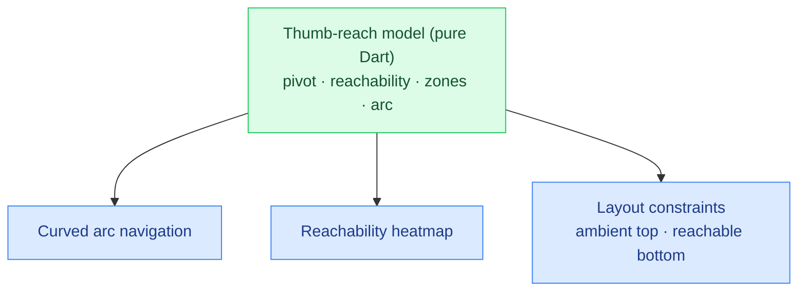

# ThumbSphere

**▶ Live demo: https://parag-labs.github.io/thumb-sphere/** — a Flutter app running on the web
(also runs natively via `flutter run`). Everything is on-device; no backend, no API keys.

A **thumb-zone-first design system** and sample app. Modern phones are big; the natural thumb arc
is small. ThumbSphere radically prioritizes that arc: the **top ~40% of the screen is ambient**
(glanceable status/content only) and **all primary navigation and actions live in a curved bottom
"sphere"** that follows the thumb's natural sweep. Toggle the reachability heatmap to see the
model, and flip handedness to watch the whole layout mirror.

---

## Why

Thumb-zone / bottom-heavy design is a major ergonomic trend for large phones, yet almost no full,
opinionated *system* exists — just one-off bottom sheets. ThumbSphere is a small, documented
system built on an explicit reachability model.

## Core idea

The ergonomics are a deterministic model in `lib/core/thumb_zone.dart`, with no Flutter
dependency:

- `thumbPivot(w, h, hand)` — where the thumb roots (near a bottom corner; mirrors by handedness).
- `reachabilityAt(point, w, h, hand)` — a 0..1 score for how comfortably the thumb reaches a
  point; falls off with distance from the pivot.
- `zoneFor(score)` — classifies a score into *easy / ok / stretch / hard*.
- `arcPositions(count, w, h, hand)` — lays navigation items along the thumb arc so a curved bottom
  nav follows the natural sweep, and (verified in tests) none of them land in a *hard* zone.

Because it's plain math, the ergonomics are unit-tested and reproducible; the Flutter layer just
places widgets where the model says.

## Architecture



## Demo

```bash
flutter run -d chrome     # web
flutter run               # a device / simulator
```

Tap the curved nav bubbles, flip **Right/Left** handedness (the arc mirrors), and turn on the
**heatmap** to see green (easy reach) fade to red (hard) — the top of the screen is clearly the
hardest to reach, which is why nothing important lives there.

## Design decisions

- **Ambient top, interactive bottom.** The top 40% (`kAmbientTopFraction`) is status/content
  only; every tappable primary control sits in the thumb arc.
- **Handedness is first-class.** The pivot and the whole arc mirror between left and right hands.
- **The arc is derived, not hand-placed.** Nav bubble positions come from `arcPositions`, so the
  layout is provably in-reach rather than eyeballed.

## Testing

`flutter test` — 11 tests: reachability ordering (near pivot > top), range bounds, handedness
mirroring, the hard top-left corner, zone thresholds, and that every generated nav position is
reachable (not *hard*).

```bash
flutter test
```

## Roadmap

- A full component library (sheets, pickers, menus) that all respect the arc.
- Adjustable pivot for different hand sizes / grips.
- A before/after mode contrasting a top-nav layout with the thumb-first one.

## Layout

```
thumb-sphere/
├── lib/
│   ├── core/thumb_zone.dart   # pure Dart: reachability + arc model (unit-tested)
│   └── main.dart              # ambient top + curved thumb-arc navigation + heatmap
├── test/                      # 11 flutter_test unit tests
└── web/
```

## License

MIT — see [LICENSE](LICENSE).
